# Illusionary Render

<!-- <p align="center">
  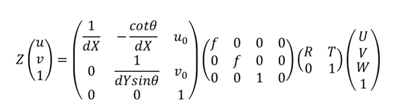
</p> -->


## Introduction
`I_render` is a rendering engine developed by Illusionary. In this project, my goal is to improve the rendering speed by applying CUDA programming. The entire task is divided into two parts:
- **CUDA rasterization**
  The CUDA rasterization part is primarily responsible for converting 3D scenes into 2D images. By leveraging the parallel computing power of the GPU, we can significantly speed up the rasterization process, resulting in faster rendering times.

- **CUDA ray tracing**
  The CUDA ray tracing part is used to simulate the propagation and reflection of light within the scene. Through CUDA programming, we can efficiently compute the interactions between light and objects, producing high-quality images.

The combination of these two parts allows `I_render` to achieve faster rendering speeds while maintaining high image quality.

## Tutorial
In this module, we will provide a brief introduction to using `I_render`. This section will cover the basic setup and essential functions needed to get started with this 3D rendering module, particularly focusing on leveraging CUDA parallelization for enhanced performance.

### Setup
To use `I_render`, ensure the following C++ libraries are installed:

- **Eigen**: For matrix operations and linear algebra computations.
- **CUDA**: For GPU-based parallelization to speed up rendering processes.
- **OpenCV** (optional): For image processing and camera transformations, if your project involves image-based operations.
- **GLM**: A C++ mathematics library for graphics software, useful for handling vectors, matrices, and transformations in 3D graphics.
- **GLEW** (OpenGL Extension Wrangler Library): For managing OpenGL extensions if rendering involves OpenGL integration.
- **OpenGL**: For 3D graphics rendering, enabling hardware-accelerated rendering capabilities in `I_render`.

Ensure these dependencies are properly set up to compile and run `I_render` efficiently.

### Run
You can directly run the `run.sh` bash in your terminal. To more details, you can modify the `src/main.cpp`, `include/camera.cuh` to get more kinds of output.

- `main.cpp`
```
Window win(IMAGE_WIDTH, IMAGE_HEIGHT, type, obj_file_name);

IMAGE_WIDTH: the resolution width of your final output.
IMAGE_HEIGHT: the resolution height of your final output.
type: use raytracer or rasterize.
obj_file_name: the mesh file.
```
- `camera.cuh`
```
bool if_depthmap = false;    // if output the depth map or not
bool if_normalmap = false;   // if output the normal map or not
bool if_pathtracing = false; // if pathtracing or not
bool if_more_kernel = false; // if use more than one kernel for each pixel
bool if_show_info = false;   // if show the information during the rendering progress

float russian_roulette = 0.80f; // RR ratio
int samples_per_pixel = 300;    // each pixel samples number
int samples_per_kernel = 20;    // each pixel kernel number

// * for rasterization
float ka = 0.1;  // ambient light ratio
float kd = 0.1;  // diffuse light ratio
float ks = 1.2;  // specular light ratio
float kn = 32.0; // exponent
```

I will present some samples in the `Gallery` part.

## Cuda rasterization
### Brief Intro
In my opinion, each rendering engine has several important parts. Even though different renderers have distinct approaches to optimization and implementation, they all consider the following key issues:
- The geometric representation of the model
- Transformation from world coordinates to the camera plane
- Lighting and shading of the model
  
The keywords are: **geometry, transformation, shading**. As for `I_render`, I addressed these three issues separately and combined them with CUDA parallelization, achieving good results.

### Implementation: geometric representation
In `I_render`, all objects are represented by triangle meshes. Each triangle consists of three vertices, and each vertex stores two attributes: normal and position. This work focuses on speed, so only the essential attributes are applied. However, extending the functionality of I_render is straightforward. Additional attributes such as UV coordinates, albedo, and others can be easily added to the vertices if needed. The following image shows the meshes of the famous stanford bunny.

```
struct Vertice{
    V3f position; // V3f is Vector-3D-float
    V3f normal;
    // other attributes.
}
```

<!-- <p align="center">
  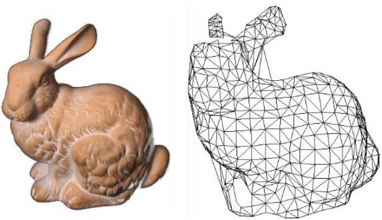
</p> -->


### Implementation: transformation
As for transformation, I borrowed a method from computer vision that is more fundamental and straightforward compared to the MVP (Model-View-Projection) transformation. Each camera has its own **intrinsic matrix**, **extrinsic matrix**, and **projection matrix**:

- **Intrinsic Matrix**:
    The intrinsic matrix $I_{3 \times3}$ represents the camera's internal parameters, such as focal length and the aspect ratio of the x and y coordinates. It can be understood as the **viewport transformation**, which maps the coordinates from the camera's image plane to the screen space. The intrinsic matrix is typically defined as:

    $$
    I = 
    \begin{bmatrix}
    f_x & 0 & c_x \\
    0 & f_y & c_y \\
    0 & 0 & 1
    \end{bmatrix}
    $$

    Where:
    - $ f_x $ and $ f_y $ are the focal lengths in the x and y directions, respectively.
    - $ c_x $ and $ c_y $ are the coordinates of the optical center (principal point) in the image plane.

- **Extrinsic Matrix**:
    The extrinsic matrix $ E_{4 \times 4} $ describes the camera's position and orientation in the world space. It transforms points from world space to view space by applying the translation and rotation of the camera. The extrinsic matrix can be written as:

    $$
    E = 
    \begin{bmatrix}
    R & t \\
    0 & 1
    \end{bmatrix}
    $$

    Where:
    - $ R $ is the 3x3 rotation matrix that represents the camera's orientation (how the camera is rotated in space).
    - $ t $ is the 3x1 translation vector representing the camera's position in world space.

- **Projection Matrix**:
    The projection matrix $ P_{3 \times 4} $ transforms points from view space to screen space, accounting for the perspective projection and creating the effect of depth in the 3D scene. For a simple perspective projection, the projection matrix is given by:

    $$
    P = 
    \begin{bmatrix}
    \frac{1}{z} & 0 & 0 & 0 \\
    0 & \frac{1}{z} & 0 & 0 \\
    0 & 0 & \frac{1}{z} & 0
    \end{bmatrix}
    $$

    Where $ z $ is the depth of the point being projected.

- **Final Transformation**:
    To transform a point $ \mathbf{X}_{world} $ in world space to screen space, you combine these three matrices. The process is as follows:
    1. First, transform the point from world space to view space using the extrinsic matrix $ E $.
    2. Then, apply the intrinsic matrix $ I $ to map from view space to camera space.
    3. Finally, apply the projection matrix $ P $ to convert from camera space to screen space.

    The final transformation can be written as:

    $$
    \mathbf{X}_{screen} = P \cdot I \cdot E \cdot \mathbf{X}_{world}
    $$

    This combination of intrinsic, extrinsic, and projection matrices defines the complete transformation pipeline from world space to screen space in computer vision and 3D rendering.

### Implementation: shading
In ``I_render``, I apply the Blinn-Phong shading method to the shader. The Blinn-Phong model mainly considers three components of illumination: ambient illumination, specular illumination, and diffuse illumination.

- **Ambient Illumination**:
Ambient illumination represents the constant light that affects all objects in the scene equally, regardless of their position or orientation. It simulates the indirect light that is scattered throughout the environment. This component ensures that objects are never completely dark, even when they are not directly illuminated.

- **Specular Illumination**:
Specular illumination is the light that is reflected in a particular direction, creating highlights on shiny surfaces. It depends on the angle between the reflected light and the viewer's direction. The Blinn-Phong model uses a more efficient approximation by calculating the half-vector between the light direction and the viewer's direction. This makes the model faster while producing visually similar results.

- **Diffuse Illumination**:
Diffuse illumination is the light that hits a surface and is scattered in all directions, giving the surface a matte appearance. It is directly dependent on the angle between the surface normal and the incoming light direction, as described by Lambert's cosine law.


The final illumination $I$ for a point on a surface is the sum of these three components:
<p align="center"></p>

Where:
- **Ambient illumination** is calculated as:  
  <p align="center"></p>

- **Diffuse illumination** is calculated using Lambert's cosine law:  
  <p align="center"></p>

- **Specular illumination** is calculated as:  
  <p align="center"></p>  
  Where:
  - $ \mathbf{H} $ is the half-vector:  
    $$ \mathbf{H} = \frac{\mathbf{L} + \mathbf{V}}{|\mathbf{L} + \mathbf{V}|} $$  
    $ \mathbf{L} $ is the light direction and $ \mathbf{V} $ is the view direction.
  - $ n $ is the shininess exponent.

This combination of ambient, diffuse, and specular illumination produces realistic lighting effects, simulating how light interacts with surfaces to create depth and highlight details in 3D rendering.


### Pipeline
In `I_render`, our pipeline can be roughly divided into the following steps:
- The first step is to read the data and initialize various parameters.
- The second step is to project the triangular mesh onto a plane based on depth, obtaining the spatial point and its related information for each pixel.
- The third step is to perform shading for each spatial point corresponding to the pixel.
  
I will seperately introduce these three steps.


#### First step: initialize
During the initialization process, we need to do the following tasks:
- We need to read the triangular mesh information in OBJ format and store it in the GPU.
- We need to set the camera viewpoint, camera position, and the camera intrinsic matrix (focal length).
- We need to set up the point light source, including its position, color, and intensity information and and store it in the GPU.

#### Second step: projection
During the process of projecting the triangular mesh, we need to transform the mesh from the world coordinate system to the camera coordinate system, as described earlier. This allows us to perform depth visibility testing more easily.

This transformation process is straightforward due to the relative independence of the triangular meshes. **We can perform parallel computation between the triangles**. Each CUDA kernel function only needs to multiply the coordinates of the three vertices of a triangle by the camera's extrinsic matrix. For the three vertices' normals, we multiply by the inverse of the extrinsic matrix to obtain the transformed **vertex coordinates** and **normal directions** in the camera coordinate system.

Next, we need to perform depth testing. Following the **Z-buffer method**, we again leverage parallelism at the triangular mesh level. Each CUDA kernel function traverses the entire triangle and, for each pixel projected onto the view plane, compares the distance from the point to the view plane with the value in the Z-buffer. If the distance is smaller, it indicates that the point is closer to the view plane, and we need to update the Z-buffer value. Additionally, we store the information of this point, such as the interpolated normal, its position in the camera coordinate system, and so on.

However, because the depth testing between each triangle is parallel, there is a possibility of two triangles competing for the same Z-buffer position, leading to data synchronization and conflict issues. To address this, I have redefined an **atomic operation** for the class to ensure that the comparison and update of the data are done safely and correctly.

#### Third step: shading
In the shading stage, since we previously obtained the spatial information for each pixel in the second step, we can use **pixel-level parallel computation** here. Each kernel function handles the shading of a single pixel. I applied the Blinn-Phong shading model for this step. The input and output of this stage is:
- Input: view position, point position, point normal, light position, light emission color, light intensity.
- Output: pixel color

The specific computation progress has been explained on the former text. And as with other rendering engines, the shader module is inherently **extensible**, allowing us to design custom shaders to achieve various effects. `I_render` primarily establishes a basic rasterization model within a parallel processing framework to achieve optimal rendering speed.

### Gallery
In this chapter, I will showcase the results achieved by `I_render`.
#### Depth map

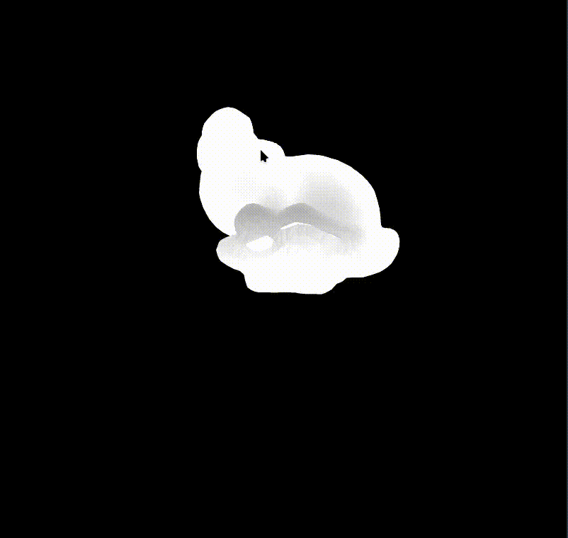

#### Normal map
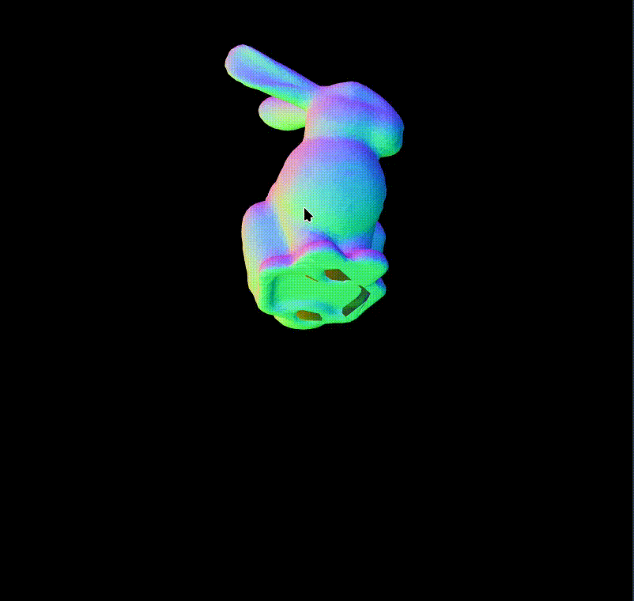

#### Diffuse model
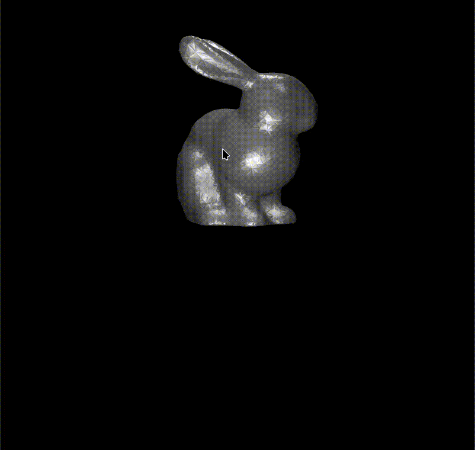


#### Metal model
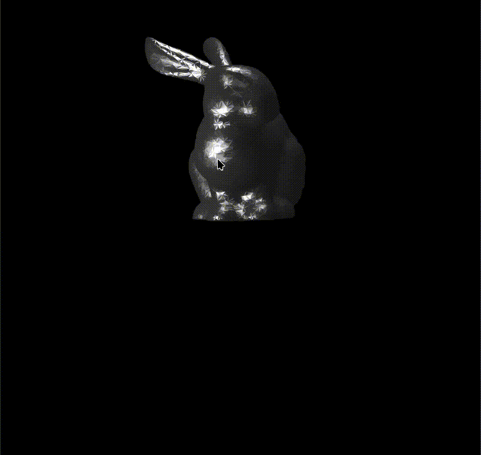


## Cuda raytracing
### Brief Intro
In my understanding, a complete ray tracing engine typically includes the following key components:
- **Generate rays**: The process of generating rays primarily involves emitting rays from the camera toward each pixel on the view plane, converting each ray into a corresponding line in the world coordinate system.
- **Geometry Intersection Calculations**: This component calculates intersections between rays and objects within the scene, determining if and where a ray intersects with geometry like triangles, spheres, or other shapes.
- **Ray Color Calculation**: This step determines the color of each ray based on lighting, materials, and shading models. It calculates the color by evaluating the effects of light sources, reflections, refractions, and surface properties at the intersection points.
- **Scattering**: Scattering refers to the process of simulating the behavior of light when it interacts with surfaces or media. In ray tracing, this can involve phenomena like reflection, refraction, or transmission of light through transparent materials, as well as the diffusion of light in materials like fog or translucent objects. Scattering helps achieve realistic lighting effects such as soft shadows, glossy surfaces, and caustics.

In `I_render`, I seperately build these several components and I will detail them in the following text.

### Implementation: generate ray
In the ray generation step, the inputs are the camera's intrinsic and extrinsic parameters, as well as the pixel positions on the camera plane. Since the computation for each ray is highly parallelizable, I implemented pixel-level parallelism. Each kernel function handles the generation of a ray corresponding to a single pixel.

#### Camera Coordinate System to World Coordinate System Transformation

   The camera's intrinsic and extrinsic parameters are used to transform from camera coordinates to world coordinates. The equation for this transformation is:

   \[
   \mathbf{r}_{world} = \mathbf{R} \cdot \mathbf{r}_{camera} + \mathbf{t}
   \]

   Where:
   - $\mathbf{r}_{world}$ is the ray in world coordinates.
   - $\mathbf{R}$ is the rotation matrix from camera to world space.
   - $\mathbf{t}$ is the translation vector (camera position in world space).
   - $\mathbf{r}_{camera}$ is the ray in camera coordinates (a vector in the camera plane).

#### Ray Equation for a Given Pixel

   For a given pixel at coordinates $(x, y)$ on the camera plane, we calculate the ray direction in the camera space. This can be done by projecting the pixel’s position in 3D space, taking into account the field of view (focal length) and the aspect ratio:

   \[
   \mathbf{r}_{camera} = \left( \frac{(x - \text{width}/2)}{f_x}, \frac{(y - \text{height}/2)}{f_y}, -1 \right)
   \]

   Where:
   - $(x, y)$ are the pixel coordinates on the camera plane.
   - $\text{width}, \text{height}$ are the resolution of the image.
   - $f_x, f_y$ are the focal lengths in the x and y directions (derived from the camera intrinsic matrix).

#### Ray Generation in World Coordinates

   After computing the ray direction in camera coordinates, we transform it to world coordinates using the camera's extrinsic parameters:

   \[
   \mathbf{r}_{world} = \mathbf{R} \cdot \mathbf{r}_{camera} + \mathbf{t}
   \]

#### Final Ray Equation

   The ray can now be represented as:

   \[
   \mathbf{R}(t) = \mathbf{O} + t \cdot \mathbf{r}_{world}
   \]

   Where:
   - $\mathbf{R}(t)$ is the ray in world coordinates at time $t$.
   - $\mathbf{O}$ is the origin of the camera (the camera position).
   - $t$ is the parameter that determines the ray's position along its direction.

This process computes the direction and origin of each ray generated from each pixel on the camera plane, allowing us to trace rays into the scene.


### Implementation: intersection calculation
For the collision calculation, since the focus of the I_render engine is not on the richness of geometric representation, all geometry (including light sources, which are also considered a form of geometry) in the ray tracing section is represented using triangular meshes. Therefore, the problem simplifies to finding the intersection points between rays and triangles.

#### Möller-Trumbore Intersection Algorithm

The Möller-Trumbore algorithm efficiently calculates the intersection of a ray and a triangle. Given a ray $ \mathbf{R}(t) = \mathbf{O} + t \cdot \mathbf{d} $ and a triangle with vertices $ \mathbf{v}_0, \mathbf{v}_1, \mathbf{v}_2 $, the algorithm computes if and where the ray intersects the triangle.

- Compute edge vectors:  
   $ \mathbf{e}_1 = \mathbf{v}_1 - \mathbf{v}_0 $, $ \mathbf{e}_2 = \mathbf{v}_2 - \mathbf{v}_0 $

- Compute the cross product of the ray direction and edge vector:  
   $ \mathbf{h} = \mathbf{d} \times \mathbf{e}_2 $

- Compute the determinant:  
   $ a = \mathbf{e}_1 \cdot \mathbf{h} $

- If $ |a| $ is small, the ray is parallel to the triangle, and there is no intersection.

- Compute the intersection parameters:  
   $ \mathbf{s} = \mathbf{O} - \mathbf{v}_0 $,  
   $ u = \frac{\mathbf{s} \cdot \mathbf{h}}{a} $  
   If $ u < 0 $ or $ u > 1 $, the intersection is outside the triangle.

- Compute the second parameter:  
   $ \mathbf{q} = \mathbf{s} \times \mathbf{e}_1 $,  
   $ v = \frac{\mathbf{d} \cdot \mathbf{q}}{a} $  
   If $ v < 0 $ or $ u + v > 1 $, the intersection is outside the triangle.

- Compute the intersection point:  
   $ t = \frac{\mathbf{e}_2 \cdot \mathbf{q}}{a} $  
   If $ t > 0 $, the ray intersects the triangle at $ \mathbf{O} + t \cdot \mathbf{d} $.

#### BVH structure
To accelerate the computation of ray-triangle intersections, I have reorganized and structured all the triangles using a **Bounding Volume Hierarchy** (BVH). 

A BVH is a tree-based data structure where each node represents a bounding volume that contains a subset of the scene's triangles. The leaf nodes of the BVH contain individual triangles, while the internal nodes contain bounding volumes that encapsulate the triangles in their child nodes.

The key advantage of using a BVH is that it allows for **efficient intersection tests** by enabling early termination in ray-triangle intersection checks. Instead of checking every triangle in the scene, we first test the ray against the bounding volumes. If a ray does not intersect a bounding volume, we can immediately discard all triangles within that volume, significantly reducing the number of intersection tests.

This hierarchical approach minimizes unnecessary calculations and accelerates the overall rendering process. I will detail the specific construction progress and collision query progress of the BVH tree through the pseudo code.

- **BVH Tree Construction**
```pseudo
function BuildBVH(triangles):
    if triangles.count() <= MAX_TRIANGLES_PER_LEAF:
        return CreateLeafNode(triangles)
    
    # Calculate bounding box for all triangles
    boundingVolume = CalculateBoundingVolume(triangles)
    
    # Split triangles based on spatial median or longest axis
    (leftTriangles, rightTriangles) = SplitTriangles(triangles)
    
    # Recursively build child nodes
    leftChild = BuildBVH(leftTriangles)
    rightChild = BuildBVH(rightTriangles)
    
    # Create a BVH node with bounding volume and children
    return CreateBVHNode(boundingVolume, leftChild, rightChild)
```
- **BVH Collision Query (Ray Traversal)**
```
function IntersectBVH(node, ray):
    if not IntersectBoundingVolume(node.boundingVolume, ray):
        return NO_HIT

    if node is LeafNode:
        closestHit = NO_HIT
        for triangle in node.triangles:
            hit = IntersectTriangle(triangle, ray)
            if hit and (closestHit == NO_HIT or hit.distance < closestHit.distance):
                closestHit = hit
        return closestHit

    # Recurse through children and check intersections
    leftHit = IntersectBVH(node.leftChild, ray)
    rightHit = IntersectBVH(node.rightChild, ray)

    if leftHit == NO_HIT:
        return rightHit
    if rightHit == NO_HIT:
        return leftHit
    return leftHit if leftHit.distance < rightHit.distance else rightHit
```
In this pseudocode:
- `BuildBVH` constructs the BVH tree by recursively splitting triangles and creating bounding volumes for each node.
- `IntersectBVH` performs a ray traversal to find the closest intersection by checking bounding volumes and, if necessary, testing each triangle in the leaf nodes.
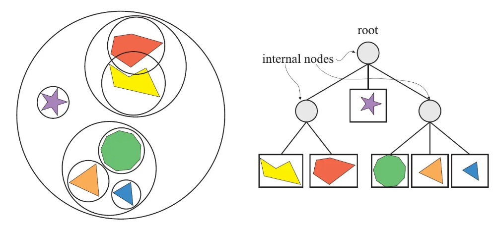


### Implementation: color calculation
In the ray tracing engine, the color calculation is based on classic radiometry principles, where the light contribution from various paths is combined to determine the color at each point. This approach involves calculating the radiance (the amount of light energy) arriving at the camera along each ray. The process includes direct illumination, indirect illumination, and various light interactions such as reflection and refraction.

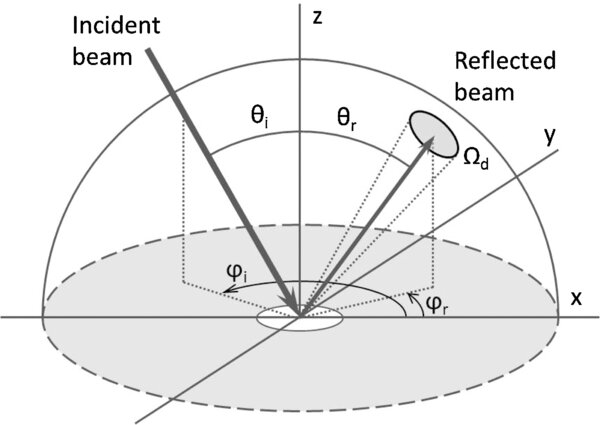


#### Steps of Radiometric Color Calculation

- **Direct Illumination**
   Direct illumination accounts for light that travels directly from light sources to surfaces. For each surface point hit by a ray, we calculate the radiance contribution from each light source that is not blocked by an object (shadow test). The direct illumination is calculated using the rendering equation:

   \[
   L_o(p, \omega_o) = L_e(p, \omega_o) + \int_\Omega f_r(p, \omega_i, \omega_o) L_i(p, \omega_i) (\mathbf{n} \cdot \omega_i) \, d\omega_i
   \]

   Where:
   - $ L_o(p, \omega_o) $ is the outgoing radiance at point $ p $ in direction $ \omega_o $.
   - $ L_e(p, \omega_o) $ is the emitted radiance from the point (for light sources).
   - $ f_r(p, \omega_i, \omega_o) $ is the bidirectional reflectance distribution function (BRDF), describing how light reflects at the surface.
   - $ L_i(p, \omega_i) $ is the incoming radiance from direction $ \omega_i $.
   - $ \mathbf{n} \cdot \omega_i $ accounts for the angle between the incoming light and the surface normal $ \mathbf{n} $, ensuring accurate brightness based on surface orientation.

- **Indirect Illumination**
   Indirect illumination considers light that bounces off other surfaces before reaching the point of interest. This includes diffuse interreflections and glossy reflections, which add realism to the scene by capturing complex light paths. Indirect illumination can be calculated through recursive ray tracing, where secondary rays are spawned from the intersection point to sample light from other surfaces.

- **Reflection and Refraction**
   For reflective and transparent surfaces, reflection and refraction rays are traced to capture light bouncing off or passing through surfaces. The reflection direction $ \omega_r $ is calculated using:

   \[
   \omega_r = \omega_o - 2(\omega_o \cdot \mathbf{n}) \mathbf{n}
   \]

   Refraction is calculated based on Snell's Law, considering the indices of refraction of the two media. This results in a transmission direction $ \omega_t $ determined by:

   \[
   \eta_i \sin \theta_i = \eta_t \sin \theta_t
   \]

   where $ \eta_i $ and $ \eta_t $ are the indices of refraction of the incident and transmitted media, respectively.

- **Final Color Computation (Recursive Ray Tracing)**
   The total color at each pixel is computed by combining the radiance from direct and indirect illumination, reflection, and refraction. For each ray, we recursively trace secondary rays based on material properties until reaching a termination condition (e.g., a maximum recursion depth or negligible radiance contribution). The final color is an accumulation of these radiance contributions weighted by the surface’s BRDF, Fresnel effects, and material absorption factors.

- **Global Illumination (Monte Carlo Integration)**
   To handle complex lighting scenarios, such as caustics and ambient light bounces, Monte Carlo integration can be used. By sampling many rays per pixel and averaging the results, we approximate the integral of radiance over all possible paths, leading to more realistic global illumination effects.

This radiometric approach in ray tracing, based on the rendering equation, accurately simulates light transport to produce lifelike images by combining direct and indirect lighting, reflection, and refraction. Each of these steps contributes to the realistic portrayal of surfaces and light interactions within a scene.

### Implementation: scatter
In the scattering module, the main consideration is the direction in which a ray will continue after colliding with a surface. This continuation is dictated by the surface properties and the physics of light-surface interaction, commonly modeled by the Bidirectional Reflectance Distribution Function (BRDF). The BRDF essentially defines the probability of light scattering in various directions from a given surface, based on the angle of incidence.

#### Key Elements of Scattering Calculation

- **BRDF and Scattering Direction**
   The BRDF, $ f_r(p, \omega_i, \omega_o) $, is a function that represents how light is reflected at an opaque surface. It is defined as the ratio of reflected radiance leaving the surface in direction $ \omega_o $ to the incoming irradiance arriving from direction $ \omega_i $. The BRDF controls the scattering direction after a ray intersects with a surface, describing both diffuse and specular reflection components.

- **Probability Density Function (PDF)**
   Since the BRDF defines how light is likely to scatter, it can be interpreted as a probability density function (PDF) over outgoing directions for a fixed incoming direction. When a ray hits a surface, the probability of scattering in a particular direction $ \omega_o $ is proportional to the value of the BRDF for that direction. This probabilistic approach is key to sampling directions in path tracing, where each outgoing direction is chosen based on this PDF.

- **Sampling the Scattering Direction**
   To determine the direction of the scattered ray, we sample according to the BRDF's PDF:
   
   - **Diffuse surfaces** (Lambertian reflectors): For purely diffuse surfaces, the BRDF is constant and scattering directions are uniformly sampled over the hemisphere around the surface normal, as these materials scatter light equally in all directions.
   - **Specular surfaces** (glossy or mirror-like): For reflective surfaces, the BRDF is sharply peaked around the mirror direction. Sampling is concentrated around this direction, leading to reflection rays close to the ideal reflection angle.
   - **Glossy surfaces**: Materials with a glossy or rough surface exhibit a combination of diffuse and specular characteristics. The BRDF in these cases often has a lobe around the reflection direction, with the scattering direction sampled based on the roughness parameter, which determines the width of this lobe.

- **Monte Carlo Integration for Scattering**
   The scattered directions contribute to the final color at the point, as each scattered ray will in turn intersect other surfaces and collect light from them. Using Monte Carlo integration, we sample several directions according to the BRDF's PDF and calculate the light contributions along these paths. The result is averaged to approximate the integral of reflected radiance, providing an accurate representation of scattering effects.

- **Importance Sampling**
   In practice, importance sampling is used to optimize the selection of outgoing directions, focusing on directions with higher probabilities as defined by the BRDF. This reduces variance in the color calculations, as more rays are concentrated in directions that significantly contribute to the final radiance.

### Pipeline
In `I_render`, ray tracing is implemented with pixel-level parallelism, where each kernel function is dedicated to calculating the color for a single pixel. The overall pipeline follows the classic path tracing algorithm, with each kernel function performing the following steps:

#### Path Tracing Algorithm for Each Pixel

- **Initialize Ray**
  - Start with a primary ray from the camera position through the pixel on the image plane.
  - Initialize accumulated color (radiance) and attenuation factors.

- **Trace Path (Loop for Each Bounce)**
  Repeat for a fixed number of bounces (or until a termination condition is met).

   ```pseudo
   while bounces < MAX_BOUNCES and ray not terminated:
       # Intersect ray with scene
       hit = IntersectScene(ray)
       
       if hit:
           # Calculate direct lighting from hit point
           directLight = CalculateDirectLight(hit, ray)
           
           # Accumulate direct light contribution
           accumulatedColor += attenuation * directLight
           
           # Sample new direction based on material's BRDF
           newDirection = SampleDirection(hit.normal, hit.material.BRDF)
           attenuation *= hit.material.BRDF(newDirection) * (hit.normal · newDirection)
           
           # Update ray for the next bounce
           ray.origin = hit.point
           ray.direction = newDirection
           
       else:
           # If no hit, accumulate background color (environment light)
           accumulatedColor += attenuation * EnvironmentLight(ray)
           break
           
       # Increment bounce count
       bounces += 1
  ```
- **Apply Russian Roulette for Early Termination**

    For optimization, apply Russian Roulette to probabilistically terminate paths with low contribution to reduce the number of calculations in deep bounces, while preserving energy conservation.
    ```
    if Random() < RUSSIAN_ROULETTE_PROBABILITY:
    break
    ```
- **Store Final Color**
  Once the maximum number of bounces is reached or the path is terminated, store the accumulated color in the pixel's final output.

This document outlines the per-pixel path tracing process with full pseudocode and an explanation of each key step in the algorithm. The following flowchart outlines the steps in the per-pixel path tracing algorithm within `I_render`. Each kernel function executes these steps independently for each pixel, allowing for highly parallelized color computation.

.png)


### Gallery
In this chapter, I will showcase the results achieved by `I_render`.

#### Mirror effect
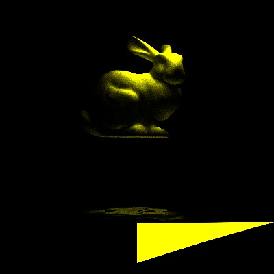


#### Real-time Raytrace: basic shading
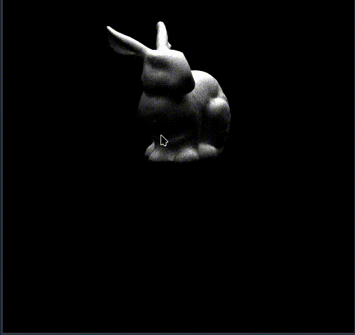

#### Real-time Raytrace: soft shadow
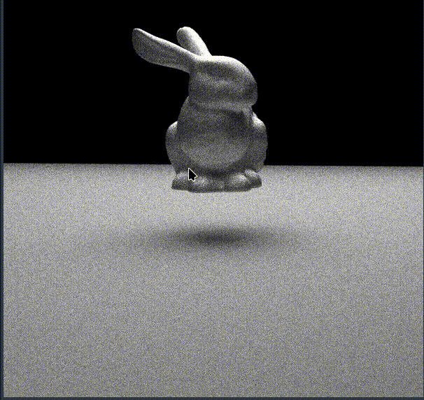

#### Real-time Raytrace: reflect


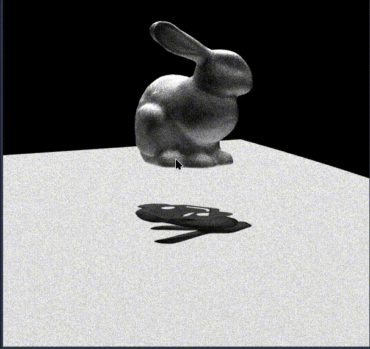

#### Real-time Raytrace: refract
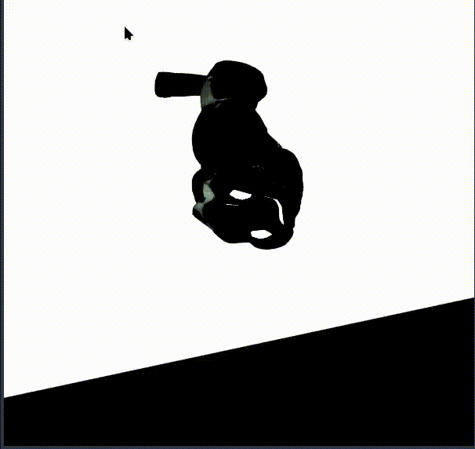
